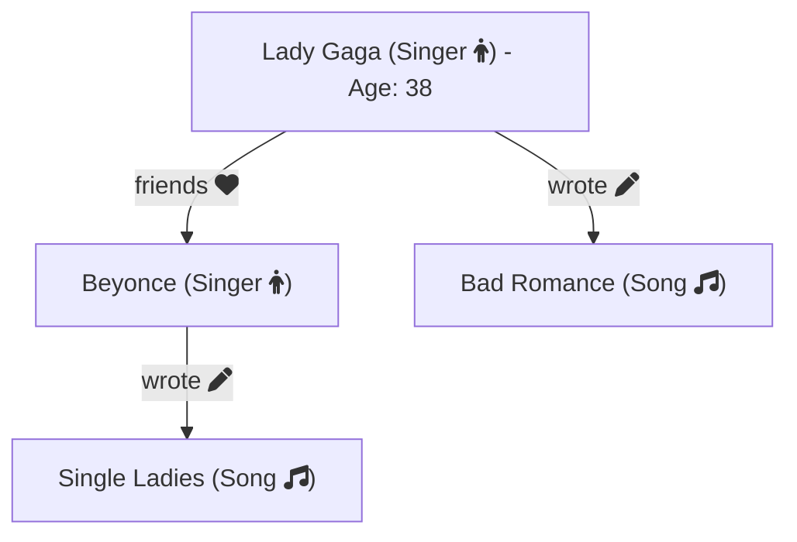

# Local Gremlin Query Testing

This script is designed to test Gremlin queries locally, simulating interactions with AWS Neptune using Gremlin Server in Docker. By running this setup, you can validate and debug Gremlin queries before deploying.

## Setup and Usage

### 1. Start the Docker Compose Environment
Navigate to the project directory and start the local Gremlin server using Docker Compose:
```bash
docker-compose up -d
```

### 2. Run the Script
Execute the Go script to run your Gremlin queries:
```bash
go run main.go
```

Any errors encountered while running the script will be logged. If the queries run successfully, a success message will be logged.

## Graph Visualisation
The simple graph used in the example can be represented with the following mermaid diagram:



## Requirements

- Docker and Docker Compose
- Go 1.23+
